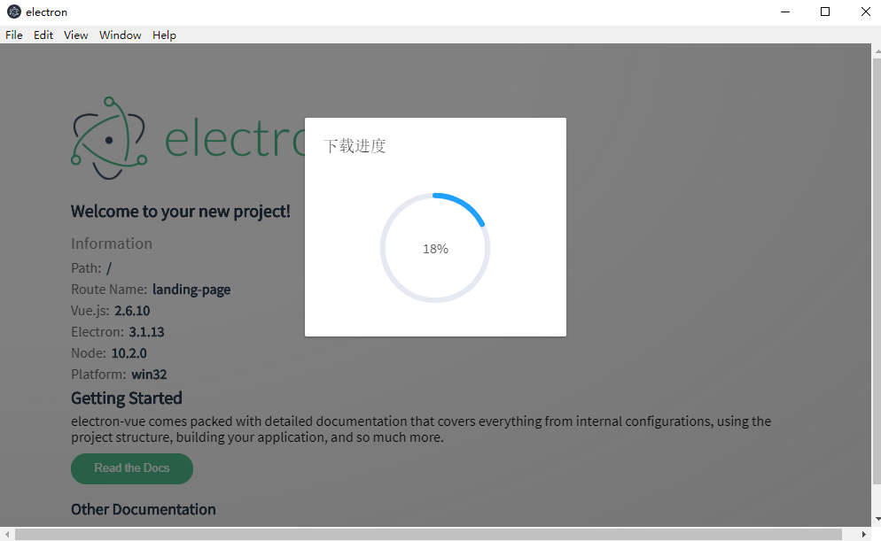
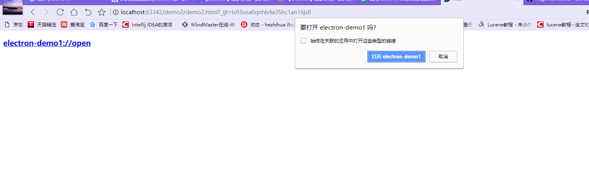

# 一、npm安装
  
  具体参考[https://www.cnblogs.com/lgx5/p/10732016.html](https://www.cnblogs.com/lgx5/p/10732016.html)

# 二、使用vue-cli构建electron项目

    vue init simulatedgreg/electron-vue my-project

## 2.1 electron官网地址
 
     https://electronjs.org/   

## 2.2 下载package.json中的依赖

    npm install
  
## 2.3 运行

    npm run dev

## 2.4 打包程序electron-builder
    npm run build

## 2.5 win32打包成exe文件
     "win": {
      "icon": "build/icons/icon.ico",
      "target": "nsis"
    },
    "nsis": {
      "oneClick": false,
      "allowToChangeInstallationDirectory": true,//自定义安装目录
      "allowElevation": true,
      "installerIcon": "build/icons/icon.ico",
      "createDesktopShortcut": true //生成桌面图标
    },
    "extraResources": {
      "from": "build/icons",
      "to": "./"
    },

说明：extraResources是把图标资源复制到打包后的根目录,以后托盘时会用到，如图，

## 2.6 使用electron-updater更新升级程序
### 2.6.1 配置更新程序的地址
>在package.json中添加如下配置：

     "publish": [
      {
        "provider": "generic",
        "url": "http://127.0.0.1:8090/demo/" 
      }
    ]

    说明：url是自己放置更新程序包的访问地址，这里的地址是使用nginx构建的文件服务器地址,上面的这个地址一定要配置，否则在打包时无法生成app-update.yml文件而会导致无法升级

### 2.6.2 添加依赖
    "electron-updater": "^4.0.0"

  >升级的时候往往就是因为electron-updater版本不搭配，导致一些乱七八糟的问题出现，此时electron的版本是2.0.4，打包的时候如果electron-updater的版本小于4.0.0，会出现无法打包，所以修改electron-updater的版本为^4.0.0

 ### 2.6.3 主进程中配置升级

      // =================================================================================================================
    // 更新升级，注意这个autoUpdater不是electron中的autoUpdater
    // 更新地址
    const fs = require('fs-extra')
    const updateURL = 'http://127.0.0.1:8090/demo/update/'
    // 检测更新，在你想要检查更新的时候执行，renderer事件触发后的操作自行编写
    export function handleUpdate () {
     //= ==============================================================================================================
    //                            清除每次更新下载的文件，否则无法进行更新
    //= ==============================================================================================================
    // updaterCacheDirName的值与src/main/app-update.yml中的updaterCacheDirName值一致，在windows中会创建一个类似
    // C:\Users\Administrator\AppData\Local\electron-updater1\pending文件存储更新下载后的文件"*.exe"和"update-info.json"
    let updaterCacheDirName = 'electron-updater1'
    const updatePendingPath = path.join(autoUpdater.app.baseCachePath, updaterCacheDirName, 'pending')
    log.warn(updatePendingPath)
    fs.emptyDir(updatePendingPath)
    log.warn(autoUpdater.app.baseCachePath)
    //= =================================================================================================================
    const message = {
        error: '检查更新出错',
        checking: '正在检查更新……',
        updateAva: '检测到新版本，正在下载……',
        updateNotAva: '现在使用的就是最新版本，不用更新'
      }
      // 设置是否自动下载，默认是true,当点击检测到新版本时，会自动下载安装包，所以设置为false
      autoUpdater.autoDownload = false
      autoUpdater.logger = log
      // https://github.com/electron-userland/electron-builder/issues/1254
      if (process.env.NODE_ENV === 'development') {
        autoUpdater.updateConfigPath = path.join(__dirname, 'default-app-update.yml')
      } else {
        autoUpdater.updateConfigPath = path.join(__dirname, '../../../app-update.yml')
      }
      autoUpdater.setFeedURL(updateURL)
      autoUpdater.on('error', function () {
        mainWindow.webContents.send(message.error)
      })
      autoUpdater.on('checking-for-update', function () {
        mainWindow.webContents.send(message.checking)
      })
      autoUpdater.on('update-available', function (info) {
        mainWindow.webContents.send(message.updateAva)
      })
      autoUpdater.on('update-not-available', function (info) {
        mainWindow.webContents.send(message.updateNotAva)
      })

      // 更新下载进度事件
      autoUpdater.on('download-progress', function (progressObj) {
        log.warn('触发下载。。。')
        console.log(progressObj)
        log.warn(progressObj)
        mainWindow.webContents.send('downloadProgress', progressObj)
      })
      autoUpdater.on('update-downloaded', function (event, releaseNotes, releaseName, releaseDate, updateUrl, quitAndUpdate) {
        ipcMain.on('isUpdateNow', (e, arg) => {
          log.warn('开始更新')
          autoUpdater.quitAndInstall()
          mainWindow.destroy()
          // callback()
        })
        mainWindow.webContents.send('isUpdateNow')
      })

      ipcMain.on('checkForUpdate', () => {
        // 执行自动更新检查
        log.warn('执行自动更新检查')
        log.warn(__dirname)
        autoUpdater.checkForUpdates()
      })

      ipcMain.on('downloadUpdate', () => {
        // 下载
        log.warn('执行下载')
        autoUpdater.downloadUpdate()
      })
    }

 说明：更新过程中出现以下问题：  
 问题1：Error: TypeError: this.app.whenReady is not a function  
 问题分析：electron 2.0.4不支持此方法，electron 3+后才支持此方法，所以升级electron为^3.0.0

 问题2：无法触发更新，控制台提示Update for version 3.1.13 is not available (latest version: 0.0.2, downgrade is disallowed) 

  问题分析：查看electron-updater模块下out/appUpdater.js中找到次错误处507行，发现isUpdateAvailable函数返回为false,isUpdateAvailable函数代码：  

      async isUpdateAvailable(updateInfo) {
      const latestVersion = (0, _semver().parse)(updateInfo.version);

      if (latestVersion == null) {
        throw (0, _builderUtilRuntime().newError)(`This file could not be downloaded, or the latest version (from update server) does not have a valid semver version: "${latestVersion}"`, "ERR_UPDATER_INVALID_VERSION");
      }

      const currentVersion = this.currentVersion;

      if ((0, _semver().eq)(latestVersion, currentVersion)) {
        return false;
      }

      const isStagingMatch = await this.isStagingMatch(updateInfo);

      if (!isStagingMatch) {
        return false;
      } // https://github.com/electron-userland/electron-builder/pull/3111#issuecomment-405033227
      // https://github.com/electron-userland/electron-builder/pull/3111#issuecomment-405030797

      const isLatestVersionNewer = (0, _semver().gt)(latestVersion, currentVersion);

      if (!this.allowDowngrade) {
        return isLatestVersionNewer;
      }

      const currentVersionPrereleaseComponent = (0, _semver().prerelease)(currentVersion);
      const latestVersionPrereleaseComponent = (0, _semver().prerelease)(latestVersion);

      if (currentVersionPrereleaseComponent === latestVersionPrereleaseComponent) {
        // allowDowngrade taken in account only if channel differs
        return isLatestVersionNewer;
      }

      return true;
    }

关键在于 const isStagingMatch = await this.isStagingMatch(updateInfo);这里返回的是false，导致无法更新，分别打印latestVersion和currentVersion发现latestVersion的值是最新安装包程序所对应的版本，而currentVersion却是electron的版本3.1.13，搜索全文发现在package-lock.json中发现electron的版本是3.1.13，所以在这里可以看出有两种解决方式，一种就是直接在package.json中修改程序的新版本大于3.1.13，另一种则是修改electron-updater中appUpdater.js中isUpdateAvailable函数代码  

    const pkg=require('../../../package.json')
    const isLatestVersionNewer = (0, _semver().gt)(latestVersion, pkg.version);

分析代码

    //这段代码获取当前版本
    if (app == null) {
        this.app = new (_ElectronAppAdapter().ElectronAppAdapter)();
        this.httpExecutor = new (_electronHttpExecutor().ElectronHttpExecutor)((authInfo, callback) => this.emit("login", authInfo, callback));
      } else {
        this.app = app;
        this.httpExecutor = null;
      }

    ....ElectronAppAdapter.d.ts
    import { AppAdapter } from "./AppAdapter";
    export declare class ElectronAppAdapter implements AppAdapter {
        private readonly app;
        constructor(app?: Electron.App);
        whenReady(): Promise<void>;
        readonly version: string;
        readonly name: string;
        readonly isPackaged: boolean;
        readonly appUpdateConfigPath: string;
        readonly userDataPath: string;
        readonly baseCachePath: string;
        quit(): void;
        onQuit(handler: (exitCode: number) => void): void;
    }

  
  问题4：出现UnhandledPromiseRejectionWarning: Error: ENOENT, dev-app-update.yml not found in D:\hzhh123\workspace\vue-work\electron-demo1\node_modules\electron\dist\resources\default_app.asar   
  问题描述：dev-app-update.yml文件不存在  
  问题分析：dev-app-update.yml文件没有打包到default_app.asar中，dev-app-update.yml的格式是怎样的，查看打包后的文件win-unpacked\resources，发现其中一个app-update.yml文件，查阅资料后发现其实dev-app-update.yml的文件内容格式是一样的，那么直接设置成一样的内容  

      provider: generic
      url: 'http://127.0.0.1:8090/demo/'
      updaterCacheDirName: electron-demo1-updater

可以发现里面的url就是安装包升级的url,updaterCacheDirName是更新时保存下载文件所用的缓存地址，组成格式是应用名称加-updater,这个目录结构在windows下一般如下：

    C:\Users\Administrator\AppData\Local\-electron-demo1-updater\pending
    
所以调试的时候可以建一个default-app.yml文件放在D:\hzhh123\workspace\vue-work\electron-demo1\node_modules\electron\dist\resources\default_app.asar 下，这里就涉及到asar解压缩，但是这样会很麻烦，打包后也需要这样替换，麻烦，所幸electron-updater中提供了这个文件的属性配置updateConfigPath，可以通过设置这个属性来解决这个问题  

    if (process.env.NODE_ENV === 'development') {
      autoUpdater.updateConfigPath = path.join(__dirname, 'default-app-update.yml')
    } else {
      autoUpdater.updateConfigPath = path.join(__dirname, '../../../app-update.yml')
    }

参考https://github.com/electron-userland/electron-builder/issues/1254

### 2.6.5 渲染更新进程
#### 2.6.5.1 新建一个组件模板components/update/index.vue

    <template>
      

        <el-dialog
          :title="title"
          :visible.sync="centerDialogVisible"
          width="40%" 
          :close-on-click-modal="false" 
          :close-on-press-escape="false"	 
          center>
          {{ remark }}
          
            <el-button size="small" type="primary" @click="updateApp">立即升级</el-button>
            <el-button size="small" @click="centerDialogVisible = false">取 消</el-button>
          
        </el-dialog>
        <el-dialog
          :visible.sync="downloadDialogVisible"
          :show-close="false" 
          :close-on-click-modal="false" 
          :close-on-press-escape="false"  
          title="下载进度"
          width="30%"
          >
          

              <el-progress type="circle" :percentage="downloadPercent"></el-progress>
          

        </el-dialog>
      

    </template>

    

#### 2.6.5.2 调用
  一般在首页调用这个组件

    <template>
      

        
        <main>
          

            
              Welcome to your new project!
            
            <system-information></system-information>
            <update-version :centerDialogVisible="centerDialogVisible"></update-version>
          

          

            

              
Getting Started

              

                electron-vue comes packed with detailed documentation that covers everything from
                internal configurations, using the project structure, building your application,
                and so much more.
              

              <button @click="open('https://simulatedgreg.gitbooks.io/electron-vue/content/')">Read the Docs</button>  
            

            

              
Other Documentation

              <button class="alt" @click="open('https://electron.atom.io/docs/')">Electron</button>
              <button class="alt" @click="open('https://vuejs.org/v2/guide/')">Vue.js</button>
            

          

        </main>
      

    </template>

    

    

最终截图：  

问题：每次只要下载后但是我不更新，我下次更新时就不起作用了
问题分析：在updaterCacheDirName目录中如果存在上次下载的安装包，下次安装时会检测安装包已存在，但是无法进行调用更新，我的解决方法是检测到有新版本时直接将其删除，然后再下载就可以了

      //= ==============================================================================================================
      //                            清除每次更新下载的文件，否则无法进行更新
      //= ==============================================================================================================
      // updaterCacheDirName的值与src/main/app-update.yml中的updaterCacheDirName值一致，在windows中会创建一个类似
      // C:\Users\Administrator\AppData\Local\electron-updater1\pending文件存储更新下载后的文件"*.exe"和"update-info.json"
      let updaterCacheDirName = 'electron-updater1'
      const updatePendingPath = path.join(autoUpdater.app.baseCachePath, updaterCacheDirName, 'pending')
      log.warn(updatePendingPath)
      fs.emptyDir(updatePendingPath)
      log.warn(autoUpdater.app.baseCachePath)

## 2.7 asar解压缩
  安装asar

    npm install -g asar
解压
  
    asar extract 压缩文件  解压文件夹

压缩：如果压缩文件存在，则会被替换

    asar pack 文件夹  压缩文件名
  
## 2.8 完整的代码
[https://gitee.com/hzhh123/electron-demo1.git](https://gitee.com/hzhh123/electron-demo1.git)

## 2.9 electron-log日志
  一开始搞更新的时候主进程是如何执行的无法看到，后来看苏南大叔的[https://newsn.net/say/electron-log.html](https://newsn.net/say/electron-log.html)后加入了日志调试才能看出问题

    "electron-log": "^2.2.17"

 主进程中配置electron-log
  
    var log = require('electron-log')
    log.transports.console.level = false
    log.transports.console.level = 'silly'

## 2.10 webapcek4打包静态资源出现找不到渲染进程找不到文件
一般是文件路径问题，配置publicPath和outputPath属性，limit属性是超过10k的图片资源就不会转化为base64编码，否则转化为base64编码

     {
        test: /\.(png|jpe?g|gif|svg)(\?.*)?$/,
        use: {
          loader: 'url-loader',
          options:{
            limit: 10000,
            name: 'imgs/[name]--[folder].[ext]',
            publicPath:'../',
            outputPath:'/'
          }
        }
      },
     
     
# 三、使用外部协议打开应用
    如使用浏览器启动electron开发的客户端应用
   
 参考：  
 [1、【Electron】酷家乐客户端开发实践分享 — 浏览器启动客户端](https://webfe.kujiale.com/browser-to-client/)  
 [2、使用 Electron 从协议处理器启动应用程序](https://segmentfault.com/a/1190000011511106)

## 写一个html页面
    
    <!DOCTYPE html>
    <html lang="en">
    <head>
        <meta charset="UTF-8">
        <title>Title</title>
    </head>
    <body>
    <a class="protocol" href="electron-demo1://open"><h3>electron-demo1://open</h3></a>
    </body>
    </html>

## 启动应用代码protocol-handler.js
    const {app, dialog} = require('electron')
    const path = require('path')
    /**
     * 使用外部协议启动应用
     */
    if (process.defaultApp) {
      if (process.argv.length >= 2) {
        app.setAsDefaultProtocolClient('electron-demo1', process.execPath, [path.resolve(process.argv[1])])
      }
    } else {
      app.setAsDefaultProtocolClient('electron-demo1')
    }
    
    app.on('open-url', (event, url) => {
      dialog.showErrorBox('欢迎回来', `您来自: ${url}`)
    })

## 将protocol-handler.js代码加入到主进程index.js中
    require('./protocol-handler')

## 打包安装程序，启动html页面，点击启动程序

# 四、注册快捷键
## 4.1 注册全局键盘快捷键
    const electron = require('electron')
    const app = electron.app
    const dialog = electron.dialog
    const globalShortcut = electron.globalShortcut
    
    app.on('ready', function () {
      globalShortcut.register('CommandOrControl+Alt+K', function () {
        dialog.showMessageBox({
          type: 'info',
          message: '成功!',
          detail: '你按下了一个全局注册的快捷键绑定.',
          buttons: ['好的']
        })
      })
    })
    
    app.on('will-quit', function () {
      globalShortcut.unregisterAll()
    })

# 五、应用菜单和上下文菜单
## 5.1 应用菜单application-menu.js
    const {BrowserWindow, Menu, app, shell, dialog} = require('electron')
    
    let template = [{
      label: '编辑',
      submenu: [{
        label: '撤销',
        accelerator: 'CmdOrCtrl+Z',
        role: 'undo'
      }, {
        label: '重做',
        accelerator: 'Shift+CmdOrCtrl+Z',
        role: 'redo'
      }, {
        type: 'separator'
      }, {
        label: '剪切',
        accelerator: 'CmdOrCtrl+X',
        role: 'cut'
      }, {
        label: '复制',
        accelerator: 'CmdOrCtrl+C',
        role: 'copy'
      }, {
        label: '粘贴',
        accelerator: 'CmdOrCtrl+V',
        role: 'paste'
      }, {
        label: '全选',
        accelerator: 'CmdOrCtrl+A',
        role: 'selectall'
      }]
    }, {
      label: '查看',
      submenu: [{
        label: '重载',
        accelerator: 'CmdOrCtrl+R',
        click: (item, focusedWindow) => {
          if (focusedWindow) {
            // 重载之后, 刷新并关闭所有之前打开的次要窗体
            if (focusedWindow.id === 1) {
              BrowserWindow.getAllWindows().forEach(win => {
                if (win.id > 1) win.close()
              })
            }
            focusedWindow.reload()
          }
        }
      }, {
        label: '切换全屏',
        accelerator: (() => {
          if (process.platform === 'darwin') {
            return 'Ctrl+Command+F'
          } else {
            return 'F11'
          }
        })(),
        click: (item, focusedWindow) => {
          if (focusedWindow) {
            focusedWindow.setFullScreen(!focusedWindow.isFullScreen())
          }
        }
      }, {
        label: '切换开发者工具',
        accelerator: (() => {
          if (process.platform === 'darwin') {
            return 'Alt+Command+I'
          } else {
            return 'Ctrl+Shift+I'
          }
        })(),
        click: (item, focusedWindow) => {
          if (focusedWindow) {
            focusedWindow.toggleDevTools()
          }
        }
      }, {
        type: 'separator'
      }, {
        label: '应用程序菜单演示',
        click: function (item, focusedWindow) {
          if (focusedWindow) {
            const options = {
              type: 'info',
              title: '应用程序菜单演示',
              buttons: ['好的'],
              message: '此演示用于 "菜单" 部分, 展示如何在应用程序菜单中创建可点击的菜单项.'
            }
            dialog.showMessageBox(focusedWindow, options, function () {})
          }
        }
      }]
    }, {
      label: '窗口',
      role: 'window',
      submenu: [{
        label: '最小化',
        accelerator: 'CmdOrCtrl+M',
        role: 'minimize'
      }, {
        label: '关闭',
        accelerator: 'CmdOrCtrl+W',
        role: 'close'
      }, {
        type: 'separator'
      }, {
        label: '重新打开窗口',
        accelerator: 'CmdOrCtrl+Shift+T',
        enabled: false,
        key: 'reopenMenuItem',
        click: () => {
          app.emit('activate')
        }
      }]
    }, {
      label: '帮助',
      role: 'help',
      submenu: [{
        label: '学习更多',
        click: () => {
          shell.openExternal('http://electron.atom.io')
        }
      }]
    }]
    
    function addUpdateMenuItems (items, position) {
      if (process.mas) return
    
      const version = app.getVersion()
      let updateItems = [{
        label: `版本 ${version}`,
        enabled: false
      }, {
        label: '正在检查更新',
        enabled: false,
        key: 'checkingForUpdate'
      }, {
        label: '检查更新',
        visible: false,
        key: 'checkForUpdate',
        click: () => {
          require('electron').autoUpdater.checkForUpdates()
        }
      }, {
        label: '重启并安装更新',
        enabled: true,
        visible: false,
        key: 'restartToUpdate',
        click: () => {
          require('electron').autoUpdater.quitAndInstall()
        }
      }]
    
      items.splice.apply(items, [position, 0].concat(updateItems))
    }
    
    function findReopenMenuItem () {
      const menu = Menu.getApplicationMenu()
      if (!menu) return
    
      let reopenMenuItem
      menu.items.forEach(item => {
        if (item.submenu) {
          item.submenu.items.forEach(item => {
            if (item.key === 'reopenMenuItem') {
              reopenMenuItem = item
            }
          })
        }
      })
      return reopenMenuItem
    }
    
    if (process.platform === 'darwin') {
      const name = app.getName()
      template.unshift({
        label: name,
        submenu: [{
          label: `关于 ${name}`,
          role: 'about'
        }, {
          type: 'separator'
        }, {
          label: '服务',
          role: 'services',
          submenu: []
        }, {
          type: 'separator'
        }, {
          label: `隐藏 ${name}`,
          accelerator: 'Command+H',
          role: 'hide'
        }, {
          label: '隐藏其它',
          accelerator: 'Command+Alt+H',
          role: 'hideothers'
        }, {
          label: '显示全部',
          role: 'unhide'
        }, {
          type: 'separator'
        }, {
          label: '退出',
          accelerator: 'Command+Q',
          click: () => {
            app.quit()
          }
        }]
      })
    
      // 窗口菜单.
      template[3].submenu.push({
        type: 'separator'
      }, {
        label: '前置所有',
        role: 'front'
      })
    
      addUpdateMenuItems(template[0].submenu, 1)
    }
    
    if (process.platform === 'win32') {
      const helpMenu = template[template.length - 1].submenu
      addUpdateMenuItems(helpMenu, 0)
    }
    
    app.on('ready', () => {
      const menu = Menu.buildFromTemplate(template)
      Menu.setApplicationMenu(menu)
    })
    
    app.on('browser-window-created', () => {
      let reopenMenuItem = findReopenMenuItem()
      if (reopenMenuItem) reopenMenuItem.enabled = false
    })
    
    app.on('window-all-closed', () => {
      let reopenMenuItem = findReopenMenuItem()
      if (reopenMenuItem) reopenMenuItem.enabled = true
    })

## 5.2 上下文菜单
主进程  
    
    const {
      BrowserWindow,
      Menu,
      MenuItem,
      ipcMain,
      app
    } = require('electron')
    
    const menu = new Menu()
    menu.append(new MenuItem({ label: 'Hello',click: () => { console.log('time to print stuff') } }))
    menu.append(new MenuItem({ type: 'separator' }))
    menu.append(new MenuItem({ label: 'Electron', type: 'checkbox', checked: true }))
    
    app.on('browser-window-created', (event, win) => {
      win.webContents.on('context-menu', (e, params) => {
        menu.popup(win, params.x, params.y)
      })
    })
    
    ipcMain.on('show-context-menu', (event) => {
      const win = BrowserWindow.fromWebContents(event.sender)
      menu.popup(win)
    })

渲染器进程(渲染进程可以不需要)  

    const ipc = require('electron').ipcRenderer
    
    // 告诉主进程在单击示例按钮时显示菜单
    const contextMenuBtn = document.getElementById('context-menu')
    contextMenuBtn.addEventListener('click', function () {
      ipc.send('show-context-menu')
    })

## 5.3 主进程与渲染进程之间的通信

>ipcMain、ipRenderer通信

  ipcMain.on('event',()=>())

  ipRenderer.once('event',()=>())  //只执行一次
  ipRenderer.on('event',()=>()) //执行多次，假如有一个按钮发送此事件，主进程只会接收一次，但主进程返回的通信会合并上几次的结果，导致不符合开发要求

>主进程向渲染进程发消息

    mainWin.WebContents.send('event',msg)  
    ipcMain.on('event',(e)=>(
      e.sender.send('event',msg)
    ))
